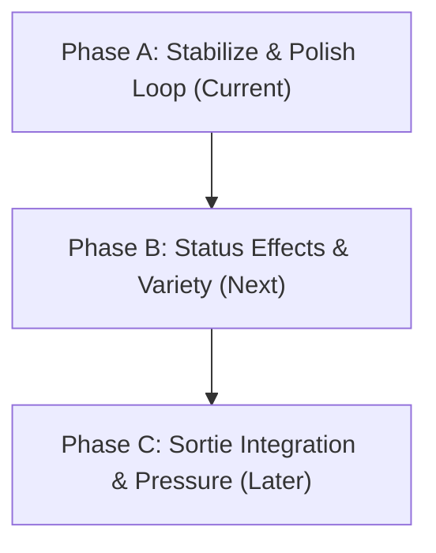

# Oplot Gameplay North Star

This document defines the gameplay identity, design principles, core fantasy, and product direction for **Oplot** following the completion of the M12.5 Combat Reformat.

---

## 1. Game Identity

**Oplot** is a mobile landscape sortie survival game focused on tactical scavenging under pressure, where players manage scarce resources while navigating a dangerous, gridless combat loop. The core combat experience is built around highly readable tactical signals—including action point (AP) preview, magazine constraints, cover states, local noise accumulation, and telegraphed enemy intents—allowing players to make critical, calculated choices to either engage or retreat. Oplot is not a full grid-based tactics game, nor is it a passive auto-battler or a spreadsheet combat simulator; it is a game of tense, compact tactical choices where every piece of ammunition and every point of noise has immediate and long-term consequences.

---

## 2. Core Fantasy

The primary emotion we want players to feel at the end of a combat encounter is: **"I barely made it out."** 

To deliver this experience, combat relies on the following gameplay dynamics:
* **Ammo Matters:** Firearms are not infinite-firing tools; ammunition Calibers are scarce, magazines are small, and reloading is a distinct tactical decision that costs action points.
* **Telegraphed Danger:** Enemies telegraph their next actions (enemy intents) transparently. The player is not guessing; they are deciding how to solve an incoming threat.
* **Retreat is a Valid Strategy:** Survival is the goal, not clean sweeps. Retreating is a respected tactical choice that preserves the player’s life and collected loot at the expense of sortie progress.
* **Noise creates Pressure:** Firing guns fills the local noise meter. Noise is not decorative; it represents mounting pressure that can alert reinforcements or elevate risk in subsequent sortie stages.
* **Concrete Choices:** Success is constructed from small, clear decisions: "Do I take cover to mitigate damage, spend AP to reload, move to a safer distance, or fire my last bullet and pray?"

---

## 3. Current Combat Pillars (Post-M12.5)

The M12.5 milestone established a solid foundation of combat systems:
1. **AP Budget & Preview:** A strict 3 Action Point system per turn with a real-time HUD preview detailing exactly how much AP an action will spend before the player commits.
2. **Ammo & Magazine Lifecycle:** A realistic ammo loop where firing depletes weapon-specific magazines, and reloading pulls caliber-appropriate ammo from the backpack reserve. Refunds are safely issued on combat exit (victory, retreat, or defeat) so unspent chambered rounds are never lost.
3. **Telegraphed Enemy Intents:** Clear visual indicators displaying exactly what action each enemy is planning next (Attack, Cover, Aim, Rush, etc.), enabling pre-emptive strategy.
4. **Gridless Distance Bands:** Simplified distance positioning (Close, Medium, Far) that modifies weapon effectiveness and movement options without requiring complex spatial grid layouts.
5. **Dynamic Cover State:** Tactical cover mechanics where players can actively take cover to mitigate ranged damage, marked by a visible HUD chip.
6. **Local Noise Mutation:** Firearms generate a noise delta (+2 for a standard shot) tracked on a scene-local level, transitioning HUD indicators from "quiet" (`тихо`) to "loud" (`слышно`, `опасно`, `критический`).
7. **Automated & Manual QA Gates:** A strict first-10-minutes QA validation protocol to ensure that gameplay remains readable, bug-free, and functional under different landscape viewports.

---

## 4. What M12.5 Changed

| Dimension | Before M12.5 | After M12.5 (Current State) |
|---|---|---|
| **Combat Readability** | Flatter HUD, opaque calculations, and hidden turn sequences. | Visible AP previews, clear enemy intent markers, cover states, and noise levels. |
| **Ammo Management** | Ammo was directly consumed from the backpack reserve. | Ranged weapons require reloading from backpack calibers into localized magazines; refunds protect loaded ammo. |
| **Tactical Options** | Mainly trading raw damage statistics with enemies. | Actions like taking cover, choosing distance-appropriate tools, managing noise, and retreating are core choices. |
| **Predictability** | High uncertainty; players couldn't plan around enemy behavior. | Enemy actions are telegraphed in advance, allowing players to counter, suppress, or avoid them. |

---

## 5. Design Principles Going Forward

To prevent development chaos and maintain codebase integrity, future iterations must adhere to these rules:
* **Small PRs First:** Never batch major changes. We deliver features in micro-slices.
* **Preflight Documentation:** Create strategy/implementation design docs before writing any code.
* **Display / Preview Before Consequence:** Always implement HUD and preview elements first, verify their layouts and interactions, and only then wire up actual gameplay mutations.
* **No Hidden Punishment:** The player must always be able to predict the consequences of their actions. There should be no invisible rolls or silent modifiers.
* **Preserve Ammo / Refund Safety:** The magazine and refund logic must remain robust. Players should never lose loaded ammo due to scene transitions.
* **Landscape Viewport Authority:** Readability at a standard 1280×720 viewport is non-negotiable. Text cannot overlap, and buttons must remain touch-target accessible.
* **Test-Driven Mechanics:** No new runtime mechanics may be merged without comprehensive regression tests and contract validation.
* **No Save / Content Creep:** Database schema and content modifications must be handled in separate, explicitly approved, and isolated changes.
* **Scene Authority:** The `CombatScene` remains the runtime source of truth until we explicitly plan and verify a transition to model-driven systems.

---

## 6. Player-Facing Rules to Keep Understandable

The player must always feel in control of the interface. We enforce these guarantees:
1. **"I can see what the enemy is likely doing next."** No surprise attacks that weren't telegraphed.
2. **"I can see my current magazine count and reserve caliber count clearly."**
3. **"I can see my noise footprint rising on the HUD."**
4. **"If I choose to retreat, my loaded magazine ammo is safely refunded to my backpack."**
5. **"If I cannot execute an action (e.g., shoot), the interface clearly states why (e.g., out of ammo, wrong distance)."**
6. **"Preview labels do not silently alter my stats or mutate runtime state."**

---

## 7. What Not to Become (Anti-Identity)

To stay focused on Oplot's unique gameplay strength, we actively avoid these paths:
* **No Opaque Roguelike Cruelty:** We avoid sudden, unexplained player deaths or silent status effects that ruin runs without warning.
* **No Spatial Grid Layouts:** We do not want to build a tile-based tactics grid. Simplified distance bands keep fights compact and mobile-friendly.
* **No Hidden Encounter Directors:** We avoid secret AI algorithms spawning random enemies behind the player's back without warning.
* **No Reinforcement Creep:** Unexplained reinforcements shouldn't drop into a fight unless directly tied to a visible, telegraphed noise trigger.
* **No Overbuilt AP Complexity:** We keep the AP budget simple (3 AP) and actions high-impact rather than introducing complex action point hierarchies.
* **No Massive Content Overhauls:** We do not rewrite the item database, calibers, or mobs registry before verifying the core tactical loops in manual QA.

---

## 8. The Next 3 Development Phases

### Phase A: Loop Stabilization (Current)
* Focus on manual QA runs, UI optimization for 1280×720 mobile landscape, and resolving any minor edge-cases.
* Eliminate visual overlaps, console errors, and softlocks.
* Solidify ammo safety and retreat paths.

### Phase B: Status Effects & Enemy Variety
* Introduce tactical status effects (Bleed, Suppressed, Exposed) first as previews, then as active gameplay status rules.
* Clean up mob behaviors and configure unique AI archetypes to match telegraphed intents.
* Make tactical movement real by adding AP costs and distance band modifiers.

### Phase C: Sortie Integration & Progression
* Connect local noise levels to global sortie danger and risk hooks.
* Introduce risk-based reinforcements and sortie exit constraints.
* Migrate state logic toward `CombatEngine` authority once scene smoke coverage is absolutely stable.
